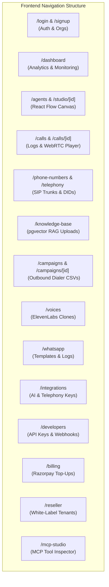

# 🎨 Auris Voice AI — Complete Frontend Architecture & Exhaustive API Mapping Blueprint

This document serves as the definitive engineering blueprint for building the **Auris Voice AI Admin Dashboard & Visual Workflow Studio**. It maps every single UI screen, page, modal, and interactive section directly to the corresponding FastAPI backend endpoints across our 18 API routers.

---

## 🛠️ 1. Recommended Frontend Technology Stack & UI Aesthetics

To deliver an interface that wows founders at first glance and feels state-of-the-art:
- **Core Framework**: **Next.js 15 (App Router)** or **Vite + React 19** with TypeScript.
- **Styling & Design System**: **Tailwind CSS v3.4+** or **Vanilla CSS Modules** featuring rich dark mode, glassmorphic panels, vibrant HSL gradients, and smooth Framer Motion micro-animations.
- **Visual Workflow Studio**: **`@xyflow/react` (React Flow 12)** with Dagre auto-layouting and custom node components.
- **Real-Time Audio Visualizer**: **WebRTC API** + **Web Audio Context** (`AnalyserNode`) for animated frequency waveforms and live volume pulsing during browser voice calls.
- **State & Data Fetching**: **TanStack Query v5 (React Query)** for server-state caching, optimistic UI updates, and automatic polling, paired with **Axios** (featuring automatic JWT Bearer token injection and refresh interceptors).

---

## 🗺️ 2. Exhaustive Page-by-Page & Section-by-Section API Mapping

---

### 🔐 Section 1: Authentication, Organization Onboarding & User Profile
**Routes**: `/login`, `/signup`, `/forgot-password`, `/org/select`, `/settings/profile`  
**Description**: Handles user registration, JWT token generation, organization selection/creation, and session persistence.

| UI Component / Action | HTTP Method | Backend API Endpoint | Request Payload / Params | Response Data |
| :--- | :--- | :--- | :--- | :--- |
| **User Registration Form** | `POST` | `/api/v1/auth/register` | `email`, `password`, `full_name`, `org_name` | `{ access_token, token_type, user, org }` |
| **User Login Form** | `POST` | `/api/v1/auth/login` | `username` (email), `password` | `{ access_token, refresh_token, user }` |
| **Fetch Current Profile** | `GET` | `/api/v1/auth/me` | *Headers: Bearer JWT* | `{ id, email, full_name, role, org_id }` |
| **Refresh Access Token** | `POST` | `/api/v1/auth/refresh` | `refresh_token` | `{ access_token, refresh_token }` |
| **List User Organizations** | `GET` | `/api/v1/auth/orgs` | *Headers: Bearer JWT* | `[{ org_id, name, role, is_active }]` |
| **Create New Organization** | `POST` | `/api/v1/auth/orgs` | `name`, `billing_email` | `{ org_id, name, created_at }` |

---

### 📊 Section 2: Dashboard & Real-Time Telemetry Overview
**Routes**: `/dashboard`  
**Description**: The landing view after login. Displays KPI cards (Total Calls, Total Minutes, Average Latency, Success Rate), daily volume charts, and system health status.

| UI Component / Action | HTTP Method | Backend API Endpoint | Request Payload / Params | Response Data |
| :--- | :--- | :--- | :--- | :--- |
| **KPI Metrics Cards** | `GET` | `/api/v1/analytics/overview` | `?date_range=30d` | `{ total_calls, total_minutes, avg_latency_ms, cost_usd }` |
| **Daily Call Volume Chart** | `GET` | `/api/v1/analytics/calls/daily` | `?start_date=...&end_date=...` | `[{ date, inbound_calls, outbound_calls, failed_calls }]` |
| **Pipeline Latency Breakdown**| `GET` | `/api/v1/analytics/latency-breakdown` | `?agent_id=optional` | `{ stt_avg_ms, llm_ttfb_ms, tts_avg_ms, total_avg_ms }` |
| **System Health Banner** | `GET` | `/api/v1/health` | *None* | `{ status: "ok", version: "1.0.0" }` |
| **Background Worker Grid** | `GET` | `/api/v1/monitor/workers` | *Headers: Bearer JWT* | `[{ worker_name, status, active_jobs, queued_jobs }]` |

---

### 🤖 Section 3: Voice Agents & Visual Workflow Graph Studio
**Routes**: `/agents` (List view), `/agents/new`, `/agents/[id]/studio` (React Flow Canvas)  
**Description**: Where founders create voice agents, configure models (STT/LLM/TTS), set prompts, and build visual multi-branch conversation trees using React Flow 12.

| UI Component / Action | HTTP Method | Backend API Endpoint | Request Payload / Params | Response Data |
| :--- | :--- | :--- | :--- | :--- |
| **List All Agents Grid** | `GET` | `/api/v1/agents` | `?skip=0&limit=50` | `[{ id, name, is_active, updated_at, voice_id }]` |
| **Create New Agent Modal** | `POST` | `/api/v1/agents` | `name`, `description`, `model_config` | `{ id, name, model_config, graph }` |
| **Get Agent Details / Config**| `GET` | `/api/v1/agents/{id}` | *Path param: agent ID* | `{ id, name, model_config, graph, created_at }` |
| **Update Agent Settings** | `PATCH` | `/api/v1/agents/{id}` | `name`, `model_config`, `is_active` | `{ id, name, model_config, updated_at }` |
| **Delete Voice Agent** | `DELETE` | `/api/v1/agents/{id}` | *Path param: agent ID* | `204 No Content` |
| **Clone Agent** | `POST` | `/api/v1/agents/{id}/clone` | `new_name` | `{ id: new_id, name: new_name, ... }` |
| **Load Studio Graph Canvas** | `GET` | `/api/v1/agents/{id}/graph` | *Path param: agent ID* | `{ nodes: [...], edges: [...], viewport: {...} }` |
| **Save Studio Graph Canvas** | `PUT` | `/api/v1/agents/{id}/graph` | `{ nodes: [...], edges: [...] }` | `{ status: "success", version: 2 }` |
| *(Retell Parity)* **Create Agent** | `POST` | `/api/v1/retell/create-agent` | `agent_name`, `response_engine`, `voice_id`| `{ agent_id, agent_name, response_engine, voice_id }` |
| *(Retell Parity)* **List Agents**| `GET` | `/api/v1/retell/list-agents`| *Headers: Bearer / API Key* | `[{ agent_id, agent_name, ... }]` |

---

### 📞 Section 4: Call Logs, Live WebRTC Testing & Recording Player
**Routes**: `/calls` (History table), `/calls/[id]` (Call detail & transcript), `/test-call`  
**Description**: Shows all past phone/web calls. Includes audio player for recordings, speaker-labeled transcripts, latency traces, and a live WebRTC audio testing widget.

| UI Component / Action | HTTP Method | Backend API Endpoint | Request Payload / Params | Response Data |
| :--- | :--- | :--- | :--- | :--- |
| **Call Logs Table** | `GET` | `/api/v1/calls` | `?agent_id=...&status=...&page=1` | `{ total, data: [{ id, caller_number, status, duration }] }` |
| **Get Call Detail & Transcript**| `GET` | `/api/v1/calls/{id}` | *Path param: call ID* | `{ id, status, transcript, summary, recording_url }` |
| **Stream Call Recording Audio**| `GET` | `/api/v1/calls/{id}/recording`| *Path param: call ID* | *Audio Stream (`audio/wav` or `audio/mp3`)* |
| **Delete Call Log** | `DELETE` | `/api/v1/calls/{id}` | *Path param: call ID* | `204 No Content` |
| **Initiate Live WebRTC Call** | `POST` | `/api/v1/calls/web-call` | `agent_id`, `metadata` | `{ call_id, access_token, webrtc_url }` |
| *(Retell Parity)* **Create Web Call**| `POST`| `/api/v1/retell/create-web-call`| `agent_id`, `metadata` | `{ access_token, call_id }` |
| *(Retell Parity)* **Create Phone Call**| `POST`| `/api/v1/retell/create-phone-call`| `from_number`, `to_number`, `agent_id`| `{ call_id, call_status: "registered" }` |
| **Terminate Active Call** | `POST` | `/api/v1/calls/{id}/end` | *Path param: call ID* | `{ status: "ended" }` |

---

### ☎️ Section 5: Phone Numbers & Telephony SIP Trunks
**Routes**: `/phone-numbers`, `/telephony/trunks`  
**Description**: Buy virtual phone numbers (DIDs) from Telnyx/Twilio or local inventory, assign them to specific voice agents, and configure custom SIP trunks / Asterisk ARI endpoints.

| UI Component / Action | HTTP Method | Backend API Endpoint | Request Payload / Params | Response Data |
| :--- | :--- | :--- | :--- | :--- |
| **List Purchased Numbers** | `GET` | `/api/v1/phone-numbers` | *Headers: Bearer JWT* | `[{ id, phone_number, agent_id, carrier, label }]` |
| **Search Available Numbers** | `GET` | `/api/v1/phone-numbers/search`| `?area_code=800&country=US` | `[{ phone_number, region, monthly_cost_usd }]` |
| **Buy & Provision Number** | `POST` | `/api/v1/phone-numbers/buy` | `phone_number`, `carrier`, `agent_id`| `{ id, phone_number, status: "active" }` |
| **Assign Number to Agent** | `PATCH` | `/api/v1/phone-numbers/{id}` | `agent_id`, `label` | `{ id, phone_number, agent_id }` |
| **Release / Delete Number** | `DELETE` | `/api/v1/phone-numbers/{id}` | *Path param: number ID* | `204 No Content` |
| **List SIP Trunks** | `GET` | `/api/v1/telephony/trunks` | *Headers: Bearer JWT* | `[{ id, name, sip_uri, carrier_type }]` |
| **Create SIP Trunk** | `POST` | `/api/v1/telephony/trunks` | `name`, `sip_uri`, `auth_user`, `auth_pass`| `{ id, name, status: "configured" }` |
| *(Retell Parity)* **Create Number**| `POST` | `/api/v1/retell/create-phone-number`| `phone_number`, `area_code`, `agent_id`| `{ phone_number, phone_number_pretty, area_code }` |

---

### 📚 Section 6: Knowledge Base RAG & Document Ingestion
**Routes**: `/knowledge-base`  
**Description**: Upload PDF, TXT, DOCX files or scrape URLs. Triggers background workers to chunk text, generate 1536-dim embeddings via `pgvector`, and attach them to agents for dynamic fact recall.

| UI Component / Action | HTTP Method | Backend API Endpoint | Request Payload / Params | Response Data |
| :--- | :--- | :--- | :--- | :--- |
| **List Knowledge Documents** | `GET` | `/api/v1/knowledge-base` | `?agent_id=optional` | `[{ id, filename, file_size, chunk_count, status }]` |
| **Upload File (PDF/TXT/DOCX)**| `POST` | `/api/v1/knowledge-base/upload`| *Multipart Form: `file`, `agent_id`* | `{ id, filename, status: "processing", chunks: 45 }`|
| **Ingest Web Page URL** | `POST` | `/api/v1/knowledge-base/upload-url`| `url`, `agent_id`, `max_depth` | `{ id, url, status: "scraping" }` |
| **Delete Knowledge Document**| `DELETE` | `/api/v1/knowledge-base/{id}` | *Path param: doc ID* | `204 No Content` |
| **Force Re-Index Document** | `POST` | `/api/v1/knowledge-base/{id}/re-index`| *Path param: doc ID* | `{ id, status: "re-indexing" }` |

---

### 🚀 Section 7: Outbound Dialer Campaigns
**Routes**: `/campaigns`, `/campaigns/new`, `/campaigns/[id]`  
**Description**: Create bulk outbound calling campaigns. Upload contact CSVs, map columns (`phone`, `name`, `custom_var`), select an agent, set dialing windows, and monitor live call completion rates.

| UI Component / Action | HTTP Method | Backend API Endpoint | Request Payload / Params | Response Data |
| :--- | :--- | :--- | :--- | :--- |
| **List Campaigns Grid** | `GET` | `/api/v1/campaigns` | `?status=all` | `[{ id, name, status, total_contacts, completed }]` |
| **Create New Campaign** | `POST` | `/api/v1/campaigns` | `name`, `agent_id`, `caller_number` | `{ id, name, status: "draft" }` |
| **Upload Contact CSV** | `POST` | `/api/v1/campaigns/upload` | *Multipart Form: `file`, `campaign_id`*| `{ campaign_id, valid_contacts: 500, rejected: 2 }` |
| **Get Campaign Progress** | `GET` | `/api/v1/campaigns/{id}` | *Path param: campaign ID*| `{ id, status, total_contacts, called, answered, failed }`|
| **Start / Resume Campaign** | `POST` | `/api/v1/campaigns/{id}/start` | `max_concurrent_calls: 10` | `{ id, status: "running", worker_job_id }` |
| **Pause Campaign Dialing** | `POST` | `/api/v1/campaigns/{id}/pause` | *Path param: campaign ID*| `{ id, status: "paused" }` |
| **Get Campaign Analytics** | `GET` | `/api/v1/campaigns/{id}/stats` | *Path param: campaign ID*| `{ avg_duration, voicemail_rate, transfer_rate }` |
| **Delete Campaign** | `DELETE` | `/api/v1/campaigns/{id}` | *Path param: campaign ID*| `204 No Content` |

---

### 🗣️ Section 8: Voice Cloning Studio (ElevenLabs & Cartesia)
**Routes**: `/voices`  
**Description**: Browse synthetic voices, listen to audio samples, and upload clean audio clips (30s–5min) to generate instant custom human voice clones via ElevenLabs.

| UI Component / Action | HTTP Method | Backend API Endpoint | Request Payload / Params | Response Data |
| :--- | :--- | :--- | :--- | :--- |
| **List Available & Cloned Voices**| `GET`| `/api/v1/cloned-voices` | `?provider=elevenlabs` | `[{ voice_id, name, provider, is_cloned, preview_url }]`|
| **Create Voice Clone** | `POST` | `/api/v1/cloned-voices/clone`| *Multipart Form: `audio_file`, `name`*| `{ voice_id, name, provider: "elevenlabs", status: "ready" }`|
| **Delete Cloned Voice** | `DELETE` | `/api/v1/cloned-voices/{id}` | *Path param: voice ID* | `204 No Content` |

---

### 💬 Section 9: WhatsApp & Multi-Channel Messaging
**Routes**: `/whatsapp`  
**Description**: Connect WhatsApp Business API credentials, configure automated post-call summary SMS/WhatsApp follow-ups, and review outbound message logs.

| UI Component / Action | HTTP Method | Backend API Endpoint | Request Payload / Params | Response Data |
| :--- | :--- | :--- | :--- | :--- |
| **Get WhatsApp Config** | `GET` | `/api/v1/whatsapp/config` | *Headers: Bearer JWT* | `{ phone_number_id, waba_id, is_connected: true }` |
| **Save WhatsApp Credentials** | `POST` | `/api/v1/whatsapp/config` | `phone_number_id`, `access_token`, `waba_id`| `{ status: "saved", verified: true }` |
| **Send Test Template Message**| `POST` | `/api/v1/whatsapp/send-template`| `recipient_phone`, `template_name`, `vars`| `{ message_id, status: "sent" }` |
| **View WhatsApp Message Logs**| `GET` | `/api/v1/whatsapp/logs` | `?page=1&limit=50` | `[{ id, recipient, template, sent_at, delivery_status }]`|

---

### 🔌 Section 10: Third-Party Vendor Integrations
**Routes**: `/integrations`  
**Description**: Connect raw API keys for speech engines (Deepgram), LLMs (OpenAI, Anthropic, Groq), TTS vendors (Cartesia, ElevenLabs), and observability platforms (Langfuse, Sentry).

| UI Component / Action | HTTP Method | Backend API Endpoint | Request Payload / Params | Response Data |
| :--- | :--- | :--- | :--- | :--- |
| **List All Provider Statuses**| `GET` | `/api/v1/integrations` | *Headers: Bearer JWT* | `[{ provider: "openai", is_configured: true, masked_key }]`|
| **Save Vendor API Key** | `POST` | `/api/v1/integrations/{provider}`| `{ api_key: "sk-...", base_url: optional }`| `{ provider, status: "connected", updated_at }` |
| **Test Vendor Connection** | `POST` | `/api/v1/integrations/{provider}/test`| *Path param: provider name*| `{ status: "success", latency_ms: 120, message: "OK" }`|
| **Remove Vendor Key** | `DELETE`| `/api/v1/integrations/{provider}`| *Path param: provider name*| `204 No Content` |

---

### 🔑 Section 11: Developer API Keys & Webhook Observability
**Routes**: `/developers/keys`, `/developers/webhooks`  
**Description**: Generate secret API keys (`ak_...`) for authenticating SDKs or REST requests. Configure global webhook endpoint URLs and view signed delivery logs (`X-Retell-Signature`).

| UI Component / Action | HTTP Method | Backend API Endpoint | Request Payload / Params | Response Data |
| :--- | :--- | :--- | :--- | :--- |
| **List Organization API Keys**| `GET` | `/api/v1/api-keys` | *Headers: Bearer JWT* | `[{ id, name, prefix: "ak_live_***", created_at, last_used }]`|
| **Generate New API Key** | `POST` | `/api/v1/api-keys` | `name`: "Production SDK Key" | `{ id, name, secret_key: "ak_live_123456789..." }` *(shown once)*|
| **Revoke / Delete API Key** | `DELETE` | `/api/v1/api-keys/{id}` | *Path param: key ID* | `204 No Content` |
| **Get Webhook Settings** | `GET` | `/api/v1/auth/orgs` *(or Agent config)*| *Headers: Bearer JWT* | `{ webhook_url, webhook_secret: "whsec_..." }` |

---

### 💳 Section 12: Billing, Credits & Razorpay Checkout
**Routes**: `/billing`  
**Description**: Pre-paid credit management (`₹1 = 1 credit`). Shows current wallet balance, estimated run-time remaining, transaction history, and initiates Razorpay popup checkout.

| UI Component / Action | HTTP Method | Backend API Endpoint | Request Payload / Params | Response Data |
| :--- | :--- | :--- | :--- | :--- |
| **Get Current Wallet Balance**| `GET` | `/api/v1/billing/balance` | *Headers: Bearer JWT* | `{ balance_credits: 5000.0, currency: "INR", auto_recharge }`|
| **List Transaction History** | `GET` | `/api/v1/billing/history` | `?page=1&limit=20` | `[{ id, amount_credits, type: "topup"\|"deduction", date }]`|
| **Initiate Razorpay Top-Up** | `POST` | `/api/v1/billing/checkout` | `amount_inr: 1000` | `{ order_id: "order_123", amount: 100000, key_id: "rzp_..." }`|
| **Verify Razorpay Payment** | `POST` | `/api/v1/billing/verify` | `razorpay_order_id`, `razorpay_payment_id`, `signature`| `{ status: "success", new_balance: 6000.0 }` |

---

### 🏢 Section 13: White-Label Reseller Portal
**Routes**: `/reseller`  
**Description**: For agency founders and enterprise resellers. Create sub-organizations (tenants), allocate pre-paid credits from the master wallet, and monitor sub-tenant call consumption.

| UI Component / Action | HTTP Method | Backend API Endpoint | Request Payload / Params | Response Data |
| :--- | :--- | :--- | :--- | :--- |
| **List Sub-Tenants Grid** | `GET` | `/api/v1/reseller/tenants` | *Headers: Reseller Admin JWT*| `[{ org_id, name, balance_credits, total_calls, is_active }]`|
| **Create Sub-Tenant Org** | `POST` | `/api/v1/reseller/tenants` | `name`, `admin_email`, `initial_credits`| `{ org_id, name, admin_user_id, balance_credits }` |
| **Get Tenant Usage Stats** | `GET` | `/api/v1/reseller/tenants/{id}/usage`| `?date_range=30d` | `{ total_calls, minutes_used, credits_deducted }` |
| **Allocate / Transfer Credits**| `POST` | `/api/v1/reseller/tenants/{id}/allocate-credits`| `credits: 500` | `{ status: "transferred", sub_tenant_balance: 1500.0 }` |

---

### 🛠️ Section 14: Model Context Protocol (MCP) Agent Inspector
**Routes**: `/mcp-studio`  
**Description**: An interactive developer console to inspect Auris's native MCP server (`/api/v1/mcp`). Test tool execution (`dispatch_call`, `create_agent`, `get_balance`) and read exposed resources directly.

| UI Component / Action | HTTP Method | Backend API Endpoint | Request Payload / Params | Response Data |
| :--- | :--- | :--- | :--- | :--- |
| **Fetch MCP Server Manifest** | `GET` | `/api/v1/mcp` | *Headers: Bearer JWT* | `{ name: "Auris MCP", version: "1.0.0", tools: [...], resources: [...] }`|
| **Execute MCP Tool Call** | `POST` | `/api/v1/mcp/tools/call` | `{ name: "get_balance", arguments: {} }`| `{ status: "success", tool: "get_balance", result: { balance: 5000 } }`|
| **List MCP Exposed Resources**| `GET` | `/api/v1/mcp/resources` | `?uri=agents://all` | `{ uri: "agents://all", data: [{ id, name, is_active }] }`|

---

## 🚀 3. Summary & Implementation Readiness
With this report, every single frontend screen is mapped 1:1 to your verified backend endpoints. Whether you choose to implement this dashboard using **Next.js 15** or **Vite + React 19**, all required backend routes, authentication schemas, CORS headers, and WebSocket transport channels are ready to serve traffic immediately!
