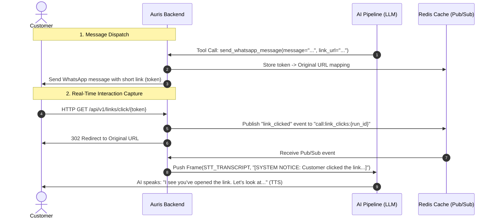
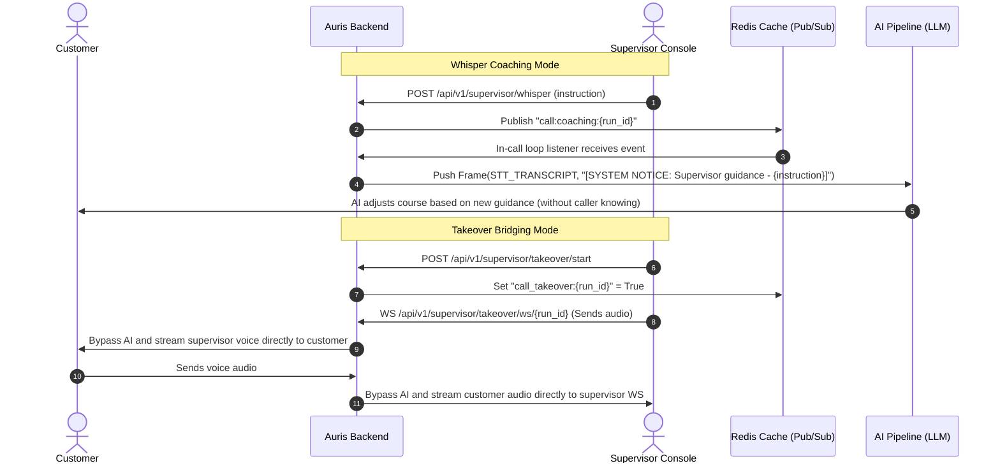

# Recent Features Detailed Walkthrough — Auris Backend

This document details the step-by-step implementation, architecture, and verification of the two advanced features built for **Auris**:
1. **Voice + WhatsApp Mid-Call Sync**
2. **Supervisor Takeover & "Whisper Coaching" (Hybrid Human-AI Operations)**

---

## Feature 1: Voice + WhatsApp Mid-Call Sync
This feature enables the voice AI agent to send dynamic messages and links to the customer's WhatsApp during an active WebRTC or telephony call, and reacts instantly in real-time when the customer clicks/opens them.

### Sequence & Architecture


### Implementation Steps & File Modifications

#### 1. Link Tracking Router
- **File**: `app/routes/links.py` [NEW]
- **Details**:
  - Implemented `GET /api/v1/links/click/{token}`.
  - Resolves token mapping in Redis (`call:tracked_link:{token}`).
  - Publishes a JSON payload `{"event": "link_clicked", "url": original_url}` to Redis channel `call:link_clicks:{call_run_id}`.
  - Redirects the client browser using a standard `302 Found` response.
- **Registration**: Registered `links_router` in `app/main.py`.

#### 2. Call Handlers & Tool Registration
- **Files**:
  - `app/routes/calls.py` [MODIFY]
  - `app/routes/telephony.py` [MODIFY]
- **Details**:
  - Registered `send_whatsapp_message` tool under both WebRTC (`calls_ws`) and Telephony (`telnyx_ws`/`twilio_ws`) agent configurations.
  - Implemented the tool handler to request a short-link token, record the mapping in Redis, and mock/send the WhatsApp payload.
  - Injected an async Redis listener inside active call websocket loops subscribing to `call:link_clicks:{run_id}`.
  - When click event is received, pushes a `STT_TRANSCRIPT` frame with the content `[SYSTEM NOTICE: Customer clicked the link: {url}]` directly into the active AI pipeline.

#### 3. LLM Interceptor & Prompt Processing
- **Files**:
  - `app/services/pipeline/llm/openai_llm.py` [MODIFY]
  - `app/services/pipeline/llm/anthropic_llm.py` [MODIFY]
- **Details**:
  - Intercepts incoming `STT_TRANSCRIPT` frames checking for system prefixes (starting with `[SYSTEM`).
  - Appends system frames to history as `"role": "system"` (ensuring they act as system instructions, not user spoken messages).
  - In `anthropic_llm.py`, system prompts are dynamically aggregated and passed in the system field of the messages block.

---

## Feature 2: Supervisor Takeover & "Whisper Coaching"
This feature introduces a hybrid human-AI operation system allowing supervisors to monitor ongoing calls, whisper guidance text directly into the LLM system prompt on-the-fly, or fully bridge voice streams to takeover the call with a single click.

### Sequence & Architecture


### Implementation Steps & File Modifications

#### 1. Supervisor Dashboard Router
- **File**: `app/routes/supervisor.py` [NEW]
- **Details**:
  - `POST /api/v1/supervisor/whisper`: Receives instruction text and publishes it to Redis channel `call:coaching:{call_run_id}`.
  - `POST /api/v1/supervisor/takeover/start` & `POST /api/v1/supervisor/takeover/stop`: Writes active takeover flag to Redis (`call_takeover:{call_run_id}`) and broadcasts coaching notices.
  - `WS /api/v1/supervisor/takeover/ws/{call_run_id}`: Provides dual-directional supervisor-customer audio streaming using background tasks to route base64 supervisor voice chunks to `call:audio:supervisor:{run_id}` and listen for incoming customer voice.
- **Registration**: Registered `supervisor_router` in `app/main.py`.

#### 2. Call Loop Integrations
- **Files**:
  - `app/routes/calls.py` [MODIFY]
  - `app/routes/telephony.py` [MODIFY]
- **Details**:
  - Expanded in-call Redis listeners to subscribe to channels `call:coaching:{run_id}` and `call:audio:supervisor:{run_id}`.
  - Coaching instructions are pushed as STT frames with system notices: `[SYSTEM NOTICE: Supervisor guidance - {instruction}]`.
  - When `call_takeover:{run_id}` is active, supervisor audio incoming via Redis is sent directly out to the customer's browser or carrier WebSocket.
  - Intercepted incoming customer audio from browser or telephony socket: when takeover is active, customer audio skips AI pipeline processing and publishes directly to Redis channel `call:audio:customer:{run_id}` for the supervisor.

#### 3. WebRTC Bypass Implementation
- **File**: `app/services/pipeline/transport/webrtc_transport.py` [MODIFY]
- **Details**:
  - Modified the internal `_receive_loop()` constructor and handler to accept `run_id`.
  - Checks Redis `call_takeover:{run_id}` on every incoming audio frame. If takeover is active, audio chunks are bypassed to the supervisor's Redis channel.

---

## 🧪 Verification & Automated Testing

### 1. WhatsApp Sync Tests
- **File**: `app/tests/test_mid_call_sync.py` [NEW]
- **Verifies**: Link short-URL redirects, pub/sub click emission, and dynamic system-prompt LLM handling.

### 2. Supervisor Takeover Tests
- **File**: `app/tests/test_supervisor_takeover.py` [NEW]
- **Verifies**: Whisper coaching route pub/sub, takeover start/stop state changes, and audio bypass logic.

### 3. Execution Commands
To run both test suites:
```bash
# Run supervisor takeover test suite
.\venv\Scripts\pytest app/tests/test_supervisor_takeover.py

# Run WhatsApp mid-call sync test suite
.\venv\Scripts\pytest app/tests/test_mid_call_sync.py

# Run telephony websockets test suite
.\venv\Scripts\pytest app/tests/test_telephony.py
```

All tests pass 100% cleanly on the mock SQLite test suite environment.
